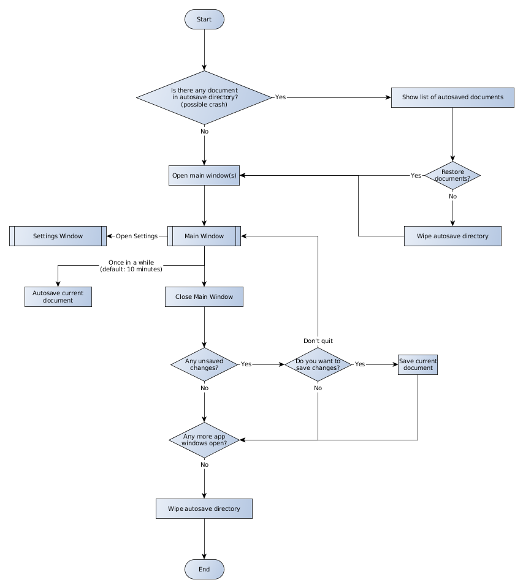
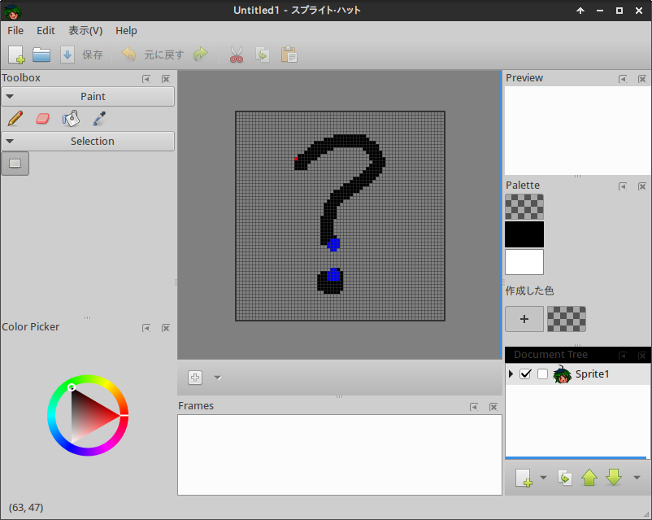

Sprite Hut functional Specification
==

Juan José Bernal Rodríguez

**Milestone:** 0.1

**First version:** February, 13th 2016

**Latest update:** February, 26th 2016

Disclaimer
--

**This specification is by no means complete**. It may and will change during development to match the project state.

Take it as a guide to get a general idea of what the software is/will be able to do, rather than a perfect definition of its current or future capabilities.

**The user descriptions portrayed in this document, as well as their names, are fictitious** and quite tongue-in-cheek, actually. If you get offended easily, please stop reading this document right now.

Overview
--

**Sprite Hut** is just a sprite editor. It **used** to *have a twist* in its description in the sense that it would allow to export not only bitmaps (image sequences and sprite sheets), but additional data useful for video game engines like texture coordinates.

As this is long overdue, *aka* it has been in *Development Hell* for quite some time now, let's get rid of some of some of the bells and whistles and provide people a useful tool to push pixels with.

 We'll revisit the *twist* part later.

User case scenarios
--

### Mona

Mona is a very special liberal-arts degree student. She dyes her hair in *vibrant* colors (at least **three**, for good measure) and uses an extremely expensive computer that she bought by mortgaging her future grandchildrens' university funds, just like every other aspiring designer in the city. "But it *was* **totally worth it**!", she yells from the end of the corridor. Yeah, sure.

She's interested in pixel art as long as it is not *too mainstream*, so right now it's a little early for her to jump off the retro bandwagon, but it's certainly starting to get crowded there. She uses **Sprite Hut** once in a while when she forgets her luxurious notebook at home and she has to use a good ol' PC in school.

### Dave
Dave is your run-of-the-mill coder. He can't draw to save his life, so he has resorted to low resolution *pixel art* because this way the chances of him achieving something half decent-looking are way higher than those of an armless monkey painting the Mona Lisa.

In addition to producing *charming programmer art*, Dave **codes**. In fact, that's what he does **90%** of the **16 hours a day** he stares at a computer screen. He knows more programming languages and frameworks than it would be reasonable for *any* human being. And every day he's learning 2 or 3 more, as if his nerd cred is going to get lower or anything.

Nevertheless, Dave is a nice chap overall. Too bad he's a **filthy**, **filthy** computer nerd and will never be able to appreciate simple pleasures of everyday life, like fresh air caressing his cheeks, sunlight bathing his skin or face-to-face human interaction for more than a few seconds every other week.

Anyway, his interest in **Sprite Hut** has its roots in the fact that it works in GNU/Linux, it's *hackable* and he can write his own plugins to export data to the 43 different game engines he tries in an average week.

### Tom
Tom is a professional animator. Sort of. Maybe. If you *do* consider Fl*sh users  professional animators.

He usually uses more powerful and bigger software for his animation work, but sees in **Sprite Hut** a nice little tool to import his artwork and export sprite sheets when he has some pending comission work for video games.

## Features

### Done
* Pixel grid
* Zoom in & out from 0.25x to 256x factor

### For this milestone (0.1)
* Indexed color mode support (8-bit, with palette)
* Multiple animations per file
* Multiple frames per animation
* Multiple layers per frame
* Multiple palettes per file
* User-customizable grid (a * b pixels)
* Auto-save

### Plugins:
* .spritehut load (builtin)
* .spritehut save (builtin)
* Image (frame by frame) import
* Image (frame by frame) export
* Sprite sheet import
* Sprite sheet export

## Non-goals for 0.1
* Non-indexed color modes support (16, 24, 32-bit, etc.)
* Creation and management of collision boxes and other shapes.
* GIF import/export plugin.
* Seamless tile painting mode (like Krita).
* Integration of MyPaint or other advanced paint engine.
* Hyerarchycal/modular sprites support (like those in Rayman or Vectorman).
* Support for pressure sensitive graphics tablets (they may still be used as regular pointing devices, just ignoring pressure information).

### Plugins
#### Would be nice to have plugins:
* JSON data import
* JSON data export
* Open Raster (.ora) support

##### Sort of ridiculous, but why not?:
* H\*m\* beads pattern export by [*yours truly*](http://github.com/jjbernal).
* GBDK C export by [*Alejandro Seguí*](http://github.com/alesegdia)

General flowchart
--

User interface
--------------
### Main Window

<small>*Current state of the main window*</small>

<small>*Future state of the main window*</small>

**Notes on current implementation:**
* Needs a good, custom palette widget.

#### Open Issues

* **Reorganization of the Widgets in Main Window**. Motivation: GDL docks not behaving as expected (GTK+ runtime warnings, freezes, canvas widgets not expanding properly when maximized)
    * Floating multiple utility windows, one for each subwidget (like in older GIMP versions, *MyPaint*, *Pixen*, older *Synfig*)
        * Pros: Easy to implement. Flexible and advantageous with multiple monitor setups.
        * Cons: People may find it clumsy. GIMP and Synfig have adopted Single window MDI some time ago, implementing their own docking widgets.
    * Single indivisible window, with customizable side and bottom panes (like gedit).
        * Pros: Relatively simple and flexible from a user/plugin customization point of view.
        * Cons: Not that good for multiple monitor setups (as subwidgets can't be dragged out of the main window).
    * Writing/adopting another, better docking widget library for GTK+ (*GIMP* and *Synfig* have their own ones).
        * Pros: The best compromise and possible solution from a user standpoint.
        * Cons: Time consuming and prone to bugs on the programming end.
    * Hybrid, limited docking  feature, like that in Inkscape. Only allow docking for some dialogs in a single column; all the other elements in the window are fixed.
        * Pros: Provides some flexibility on the ui for users while not messing with the general window layout.
        * Cons: GDL is still there.

#### Canvas widget

This is the main widget and main work area of the application.
Features a painting area delimited by a rectangular border, a background and a pixel grid, which appears when zooming in images for pixel-perfect precision. Optionally, the user can show or hide a user-defined grid.
>#### User-customizable settings:
* Canvas border width (in pixels, default 2)
* Canvas border color (default: black, #000000)
* Background (a tileable bitmap, definable per file)(default: checkerboard)
* Minimum zoom level to show the pixel grid (default: 4x)
* User-defined grid:
    * Width and height
    * Line color
    * Visibility

>#### Technical note:
The Canvas widget itself should *not* draw anything on layers by itself, but forward coordinates
on click/tap/mouse down events to a drawing/paint engine via a GTK+ signal. This way, the
widget is detached from the model and we can adopt more advanced and powerful paint engines in
the future, or alternative view modes (tiling mode ala krita).

#### Tools widget

This widget sports the different tools that can be used on the canvas.

* **Pencil**. Draws freehand lines.
* **Eraser**. Erases freehand lines to transparent color.
* **Color picker**. Sets current selected color based on a click on the canvas.
* **Bucket fill**. Fills a closed area with current selected color.

#### Palette widget

Shows colors that the current palette contains.
Clicking on a color will set it as the current drawing/painting color.
Double-clicking on a color allows to edit its components (RGB, HSV, etc.)
Dragging and dropping a color onto another reorders colors.

>#### User-customizable settings:
* Color rectangle size.
    * small (24x16)
    * medium (32x24)
    * large (64x48)
    * custom (user-defined)
* Show color indices by default

>#### Technical note:
Should watch the current palette property from the *document* to update its contents.

#### Project widget

This is the most complex widget in the main window and probably in all Sprite Hut. It actually consists in several subwidgets that contain each other, reflecting the structure of a Sprite Hut project. Namely:

* **Project**: This is the root node, so to speak, of the project structure. Here, users can define project-wide parameters such as default FPS and loop types for animations, and access top level elements like Animations and Palettes.
* **Animations**: This is the list of animations in the project. The user can create new animations, as well as duplicate, edit or remove existing ones. Animation properties are:
    * *FPS* Short for *Frames Per Second*, this parameter sets the animation playing speed. The more FPS, the smoother and more life-like the animation becomes, but the more frames have to be drawn per second of animation. Typical cartoons for movies and TV range from 15 to 24 fps, while old and retro videogames may get away with as little as 2 or 3 fps.
    * *Loop type*. You can choose between Straight (no loop), Repeat or Ping-pong.
* **Layers**: This is the layer list for current animation.
    * *Visible (Eye icon)* Show or hide the layer.
    * *Locked (Lock icon)* Lock the layer to prevent painting on it accidentally.
* **Timeline**: Actually more of a *time grid*, as it shows the list of frames of the current animation and the layers than conform each frame.

>#### User-customizable settings:
* Default FPS for new animations
* Default loop type for new animations
* (to be discussed) Global layers.

>#### Technical note:
As GTK+ TreeViews, TreeModels and related classes are incredibly powerful but also an incredible pain to implement even the most simple of models, this widget will use almost entirely Cairo or Clutter for its rendering and a simple interface to interact with the underlying document model. Some GTK+ widgets, like Entry (for editing), or Labels(for visualizing text), may be used internally, but just in cases for which they're the simplest solutions and provide the best experience for users.

>Anyway, Project, Animations and Layers subwidgets will share most of their code as they share similar features to maximize code reuse. The Timeline/Timegrid part is somewhat different... we'll see.

### Preferences/Settings dialog

This dialog should let users change default settings to their taste.
Settings in this Window appear throughout this document in a *User-customizable settings* section for each feature.

This part should discuss the dialog structure and appearance, not every setting in the application to avoid duplicating work.

[Mockup image pending]

### Menus

Other Features
--
### Auto-save

There are many factors that can interrupt abruptly the execution of a program and cause data loss if the user was working on some artwork. Power outages, broken hardware, accidental shutdowns or a simple CTRL+C when running from a console under GNU/Linux. Sprite Hut itself shouldn't crash by itself, but that can't be ruled out either in all and every possible situation.

That's why Sprite Hut saves a copy of currently open files to disk periodically. That way, if anything makes the application stop from working and shutting down properly and the user didn't save often their work by themselves, an autosaved copy of it can be retrieved and resume the working session.

The sequence of a typical use case would be:

1. The user (say, Mona) is working on something.
2. Something bad happens and Sprite Hut stops working.
3. Mona starts Sprite Hut again (immediately or months later, that's irrelevant) and is welcome with a dialog window that shows a list of her last session open projects and lets her choose whether she wants to restore them.
4. Mona chooses to restore. Sprite Hut opens the autosaved copies and she keeps working on them.

>#### User-customizable settings:
* Enable/disable (default: enabled)
* Backups/temporal directory (default: to be determined)
* Auto-save interval (in minutes) (default: 10 minutes)

### Undo

Just to let users undo and redo their changes to the open *projects*.
Undoable actions include:
* Paint/draw on canvas.
* Create, modify and delete elements from the project.

Not undoable (as they are really not *destructive* but will be saved to file for convenience):
* Change Zoom level.
* Change selected element(s) of the project.
* Change window layout.

    **An idea** Using git or another Concurrent Version System could be an option.

.spritehut file specification
--
Basically a .zip containing individual frames and document structure definition very similar to Open Raster.
>#### Technical note:
* Review .ora's (Open RAster) current state and viability as a format to store Sprite Hut data (Layers, frames, animations, palettes).
(*to be written in its own document*).
>### Open issues:
* ¿Use XML or JSON for structure file?
    * Both are ubiquitous
    * JSON is less verbose
    * Maybe XML is more eXtensible?
    * JSON integration in vala and GObject looks great.
    * libxml is not so

Plugin system
--
This section is mostly aimed at those technically inclined users, like our friend Dave. Most users won't be able to write their own plugins for Sprite Hut, but they surely would appreciate some additional functionality bits for their sprite editor. For them, there should be a tab in the [Settings dialog](#Preferences/Settings_dialog) so they can enable/disable plugins and change their options, if any.

In order to keep features manageable for this release, the only available interfaces will be those to import and export data from files other than .spritehut.

### Open issues:

* Use libpeas or roll our own?
